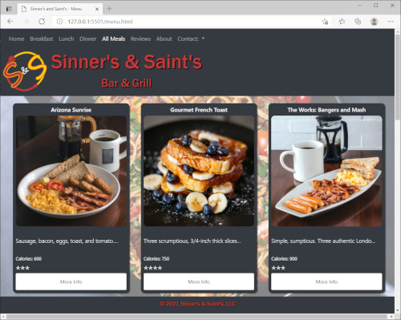

# Demo Sinner's & Saint's  Web Site
## Description:
This web site was developed for a mock up bar and grill restaurant in whereas to showcases their available cuisine and events that are provide at the fine establishment. Hence, allowing potential customers the ability to browse by meal, while also seeing more detailed information about a selected dish. Therefore, not to be limited to but including a full description of the pricing, calories, rating, drink pairings, and allergies. Additionally, a potential customer may rate dish’s and or preview the restaurants reviews and possibly leaving one of their own.
### Screen Shot:
 

## Languages
This page was written using HTML5, CSS, Javascript, jQuery, and Bootstrap.
## Authors / Contributors
Shane Brans,  James M. Cox Jr., John Horonzy, Craig Sorenson
## How to use
Open the site's index.html in Edge, Firefox, Chrome, Safari. Internet Explorer is not supported.
## License
Creative Commons